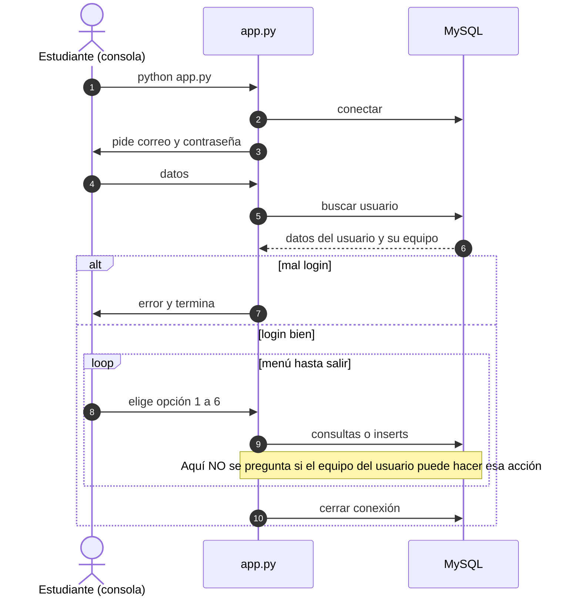

# Guía del taller — Archivo de casos especiales (CE-1115)

Esta guía define el **qué** hay que lograr y el **por qué** (conceptos y matriz). El **cómo** lo implementan —estructura del código, nombres de funciones, orden de refactors— queda **a criterio de su equipo**; así el taller ejercita criterio, no copiar una receta.

---

## 1. La historia (contexto)

El **Tecnológico de Costa Rica** nace en **1971**. Desde esa misma época opera, en la sombra administrativa del campus, la **Unidad de Casos Especiales (UCE)**: un equipo que documenta fenómenos que no entran en los informes oficiales del día a día. No es ciencia ficción para el pasillo; es **archivo interno**, con reglas duras de quién ve qué.

La UCE clasifica el trabajo en tres frentes:

- **OVNIs** — luces, trayectorias imposibles, silencios en radar…
- **Fantasmas** — presencias, ruidos, registros de campo en edificios…
- **Wizards** — expediente académico-arcano: símbolos, bibliografía maldita de broma, correlaciones raras con el archivo histórico del TEC.

Cada investigador está asignado a **un solo frente**. Cruzar información entre frentes sin autorización es **incidente de seguridad**: filtración de expediente.

**El problema que tienen delante:** el sistema nuevo (`app.py` + MySQL) **identifica** bien al agente (correo + contraseña), pero **no encadena** esa identidad con los permisos. Un analista de OVNIs puede abrir listas de fantasmas, leer notas de magos y hasta escribir en nombre de otro equipo.

**Su misión en el taller:** cerrar esas grietas **por etapas**: primero la **matriz de acceso** (quién puede qué), luego endurecer contraseñas, luego un **segundo factor** por correo para entrar al archivo.

---

## 2. Qué van a usar

| Archivo | Para qué sirve |
|---------|----------------|
| `schema.sql` | Crea la base de datos y los datos de prueba. |
| `app.py` | Programa de consola: login y menú. |
| `README.md` | Cómo instalar y ejecutar. |
| `requirements.txt` | Librería de Python para MySQL. |

---

## 3. Marco teórico (ideas que tienen que quedar claras)

### 3.1 Autenticación — “¿Quién eres?”

Es el **login**: correo + contraseña (y más adelante un código extra).

Si el login falla, la persona **no entra**.

Si el login funciona, ya sabemos **quién** es y a **qué equipo** pertenece (eso viene de la tabla `users` en la base de datos).

### 3.2 Autorización — “¿Qué te dejo hacer?”

Después del login, el sistema debe decidir cosas como:

- ¿Puede ver **solo** sus listas o las de todos?
- ¿Puede escribir notas **solo** para su equipo?

Eso es **autorización**. En este taller la llamamos también **matriz de acceso**: una tabla sencilla de “quién puede qué”.

**Idea clave:** una contraseña buena **no arregla** permisos mal puestos. Son cosas distintas.

### 3.3 Matriz de acceso (resumen en palabras)

- El equipo **OVNI** solo maneja la tabla `ovnis` y las notas con `team_id = 1`.
- El equipo **Ghosts** solo maneja `ghosts` y notas con `team_id = 2`.
- El equipo **Wizards** solo maneja `wizards` y notas con `team_id = 3`.

Hoy el programa **no respeta** eso. Ustedes lo harán respetar en la **Etapa 1**.

### 3.4 Contraseñas: hash (Etapa 2)

Guardar la contraseña como texto en la base de datos es **malo**. Lo normal es guardar un **hash** (un “resumen” matemático). Así, si alguien roba la base, no lee la contraseña tal cual.

En clase: **hash** para contraseñas; no confundir con “encriptar” como si fuera un candado que se abre con la misma llave.

### 3.5 Segundo factor — 2FA (Etapa 3)

Después de la contraseña, el sistema manda un **código corto** al correo (por ejemplo con Resend). Sin ese código, **no** hay menú.

Eso ayuda si roban la contraseña… **pero** igual hace falta la **Etapa 1**: si los permisos están mal, el atacante sigue viendo datos de más.

### 3.6 MySQL y “RLS”

PostgreSQL tiene algo llamado **RLS** (la base filtra sola las filas). **MySQL no trae eso igual.** Por eso, en este curso, la **Etapa 1** se hace sobre todo en **Python**: antes de ejecutar un `SELECT` o `INSERT`, el programa comprueba el equipo del usuario.

---

## 4. Qué hay en la base de datos (muy resumido)

- **`teams`:** los tres equipos (ovni, ghosts, wizards).
- **`users`:** correo, contraseña (hoy en texto plano, mal a propósito) y a qué equipo pertenece.
- **`ovnis`, `ghosts`, `wizards`:** listas de “casos” de cada tipo.
- **`notas`:** texto de investigación; cada nota tiene un `team_id` (dueño del expediente).

Correos de prueba y clave: ver el **anexo** al final.

---

## 5. Matriz que deben lograr en código (Etapa 1)

**L** = puede listar. **E** = puede agregar filas. **—** = no puede.

| Equipo | Tabla OVNIs | Tabla Fantasmas | Tabla Magos | Notas |
|--------|-------------|-----------------|-------------|--------|
| OVNI | L y E | — | — | Solo las que tienen `team_id = 1` |
| Ghosts | — | L y E | — | Solo `team_id = 2` |
| Wizards | — | — | L y E | Solo `team_id = 3` |

**Implementación:** deben hacer que el comportamiento del programa **coincida** con esta tabla. No se entrega checklist de funciones ni orden de parches: lean el código, el diagrama de la sección 6 y decidan ustedes dónde encaja la validación.

---

## 6. Diagrama: cómo funciona la app **ahora** (antes de arreglarla)

Sirve para el informe: muestren **dónde** entra el login y **dónde** falta el control de permisos.

**Lectura sencilla del diagrama**

- Primero: **entrada** (¿quién eres?) → eso está.
- Después: el menú habla con la base **sin** volver a mirar el equipo → **ahí está el problema** del taller.

---

## 7. Etapa 0 — Ver el problema (casi sin programar)

**Meta:** constatar que el sistema permite **más** de lo que la matriz (sección 5) autoriza.

**Tarea:** montar el entorno según `README.md`, ejecutar la app y, entrando con **un** usuario de un solo frente, **documentar** varias acciones que hoy son posibles pero que **violan** la matriz (qué vieron o modificaron y por qué era indebido).

**Entrega sugerida:** breve (párrafo o lista corta), sin tutorial paso a paso en el informe.

---

## 8. Etapa 1 — Arreglar permisos (lo más importante)

**Meta:** el programa **respeta** la matriz de la sección 5 en todas las rutas del menú (catálogos y notas).

**Criterios de aceptación (prueben con los tres usuarios demo):**

- Un agente de un frente **no** lista ni inserta en tablas de otros frentes.
- Un agente **no** lista ni crea notas con `team_id` ajeno al suyo.

**Debate en clase (opcional):** endurecer solo en Python vs también restringir en MySQL (usuarios/permisos de BD, o en otro curso RLS en PostgreSQL).

---

## 9. Etapa 2 — Contraseñas más seguras (hash)

**Meta:** las contraseñas **no** quedan almacenadas de forma que alguien con acceso a la tabla las lea tal cual.

**Criterio de aceptación:** esquema y login alineados con almacenamiento por **hash** (p. ej. Argon2 o bcrypt); usuarios demo siguen pudiendo entrar tras migrar la clave de prueba.

---

## 10. Etapa 3 — Código al correo (2FA con Resend)

**Meta:** después de validar correo + contraseña, el acceso al menú exige un **segundo factor** enviado al correo (Resend u otro canal acordado con el profesor).

**Criterios de aceptación:** el código es de un solo uso, tiene caducidad razonable, **no** se guarda en claro en la base, y sin código válido no hay sesión de archivo.

**Recordatorio:** 2FA endurece **quién entra**; no sustituye una matriz mal aplicada en la Etapa 1.

---

## 11. Resumen de etapas (una mirada)

| Etapa | Tema | En una frase |
|-------|------|----------------|
| 0 | Diagnóstico | Probar la app y describir el desorden de permisos. |
| 1 | Permisos / matriz | Cada equipo solo ve y escribe lo suyo. |
| 2 | Hash | La base no guarda contraseñas leíbles. |
| 3 | 2FA | Hace falta el código del correo para entrar al menú. |

---

## 12. Anexo — Usuarios de prueba

| Correo | Equipo (en la base) | Número de equipo (`team_id`) |
|--------|---------------------|------------------------------|
| `ovni@lab.local` | ovni | 1 |
| `ghosts@lab.local` | ghosts | 2 |
| `wizards@lab.local` | wizards | 3 |

Contraseña de prueba (hasta que cambien la Etapa 2): `demo123`.

---

*Guía del taller `ejercicio-auth` — UCE desde 1971. CE-1115: control de acceso y autenticación. Metas y criterios; la implementación la define cada equipo.*
